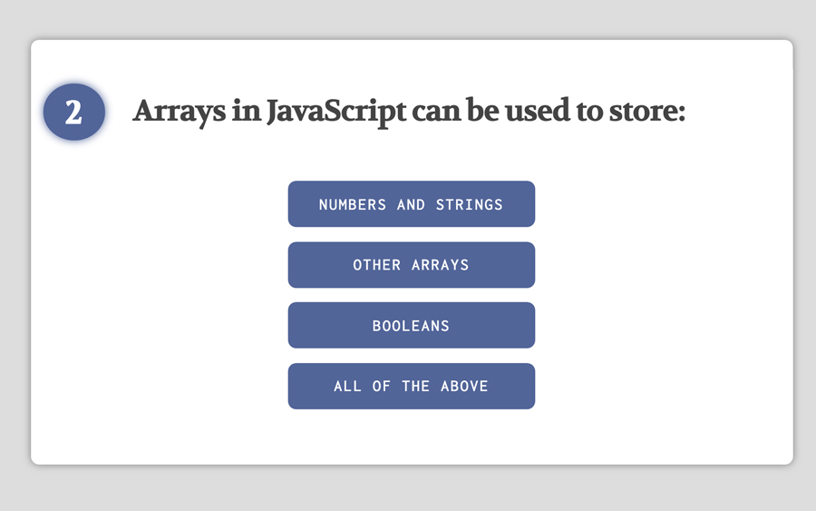
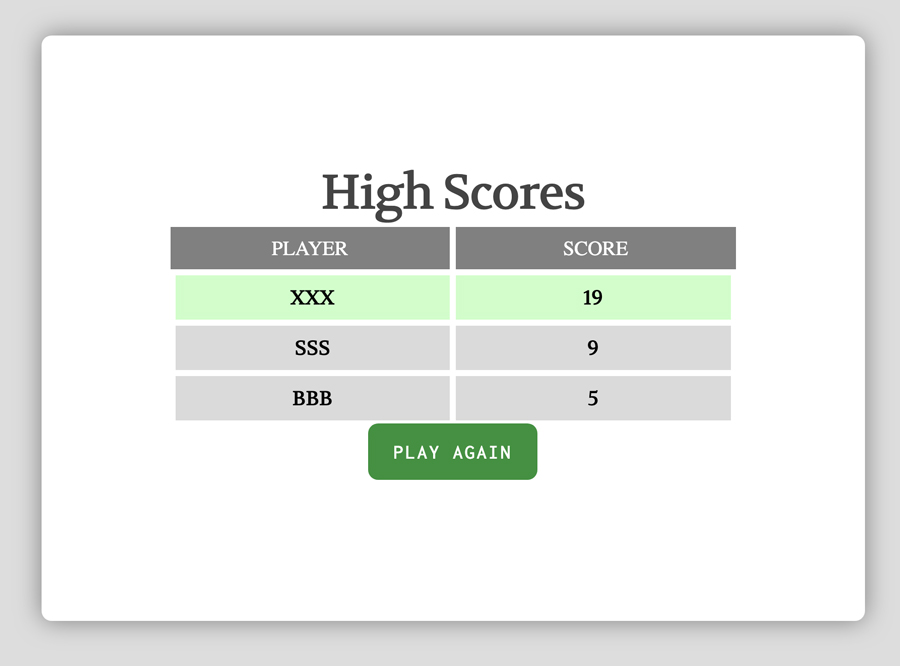

# code-quiz
This application displays a series of questions to quiz the user on their knowledge of Javascript.

<a href='https://b0rgbart3.github.io/code-quiz/'>Live Demo</a>
## User Story

```
AS A student of Javascript
I WANT to take a timed quiz on some of the fundamentals
SO THAT I can gauge my progress compared to my peers
```

## Features

1.  Each question has a weighted-score value from 1 - 10.  
2.  The final score is displayed to the user at the end of the quiz.
3.  The user is given the option to save their score, with their initials, so their score can be compred against others.
4.  Keeps track of the users current and final score
5.  Displays high scores with player initials in a list
6.  Allows user to play again.

## Technologies
1.  Javascript
2.  HTML5 / CSS3
3.  HTML5 based audio with MP3s for correct and incorrect answers
4.  Sass compiler for button styling

## screens


